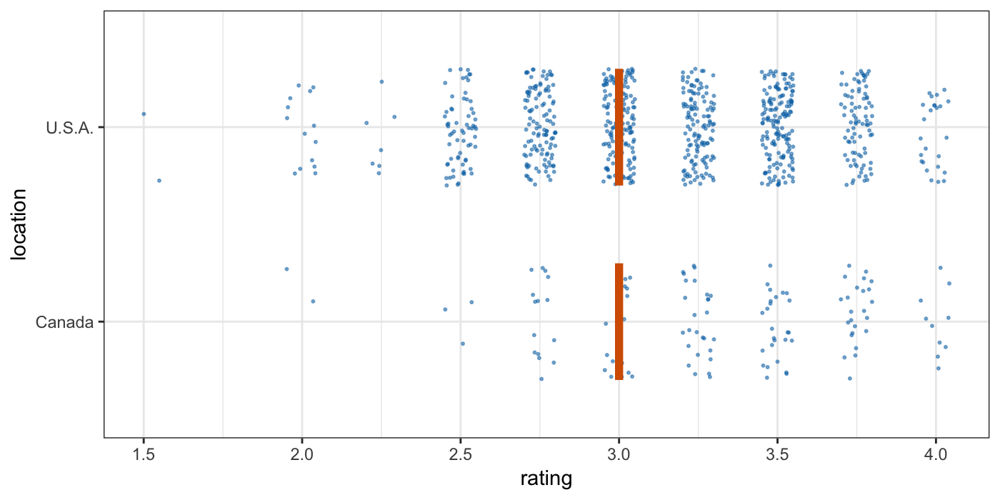
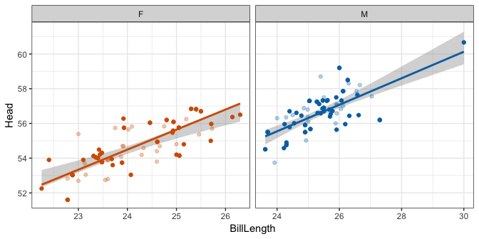
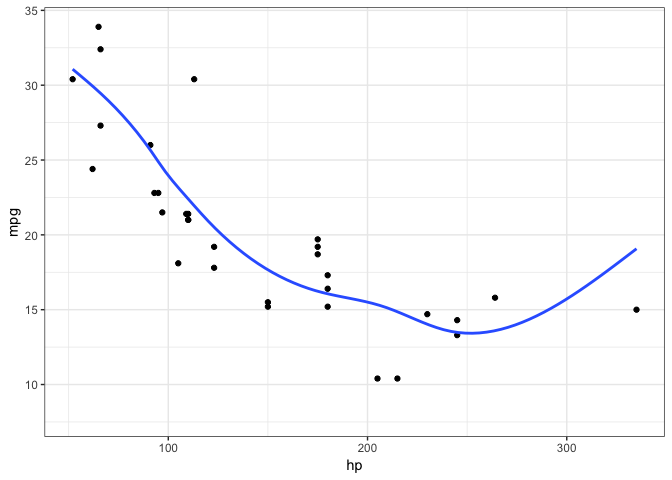
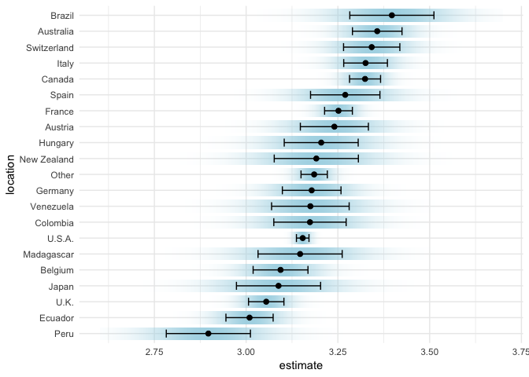

<!-- README.md is generated from README.Rmd. Please edit that file -->

# ungeviz

Tools for visualizing uncertainty with ggplot2.

This package is meant to provide helpful add-on functionality for
ggplot2 to visualize uncertainty. The package is particularly focused on
hypothetical outcome plots (HOPs) and provides bootstrapping and
sampling functionality that integrates well with the ggplot2 API.

The package name comes from the German word “Ungewissheit”, which means
uncertainty.

## Installation

``` r
devtools::install_github("wilkelab/ungeviz")
```

## Sampling and bootstrapping

The `sampler()` and `bootstrapper()` functions generate sampling and
bootstrapping objects, respectively, that can be used in place of data
in ggplot2 layers. These objects are helpful when creating HOPs.

``` r
library(ggplot2)
library(dplyr)
library(forcats)
library(ungeviz)
library(gganimate)

cacao %>% filter(location %in% c("Canada", "U.S.A.")) %>%
  ggplot(aes(rating, location)) +
  geom_point(
    position = position_jitter(height = 0.3, width = 0.05), 
    size = 0.4, color = "#0072B2", alpha = 1/2
  ) +
  geom_vpline(data = sampler(25, group = location), height = 0.6, color = "#D55E00") +
  theme_bw() + 
  # `.draw` is a generated column indicating the sample draw
  transition_states(.draw, 1, 3)
```

<!-- -->

Both the bootstrapper and sampler objects can be used for repeated
reproducible sampling, by passing the same bootstrapper or sampler
object as data to multiple ggplot2 layers.

``` r
data(BlueJays, package = "Stat2Data")

# set up bootstrapping object that generates 20 bootstraps
# and groups by variable `KnownSex`
bsr <- bootstrapper(20, KnownSex)

ggplot(BlueJays, aes(BillLength, Head, color = KnownSex)) +
  geom_smooth(method = "lm", color = NA) +
  geom_point(alpha = 0.3) +
  # `.row` is a generated column providing a unique row number for all rows
  geom_point(data = bsr, aes(group = .row)) +
  geom_smooth(data = bsr, method = "lm", fullrange = TRUE, se = FALSE) +
  facet_wrap(~KnownSex, scales = "free_x") +
  scale_color_manual(values = c(F = "#D55E00", M = "#0072B2"), guide = "none") +
  theme_bw() +
  transition_states(.draw, 1, 1) + 
  enter_fade() + exit_fade()
```

<!-- -->

## Smooth draws

Instead of bootstrapping smoothers or regression lines, we can also fit
a smoothing model to the data and then generate fit lines by randomly
drawing from the posterior distribution. This strategy is automated in
`stat_smooth_draws()`, which works similar to `stat_smooth()` but
generates multiple equally probable fit draws rather than one best-fit
line.

``` r
ggplot(mtcars, aes(hp, mpg)) + 
  geom_point() +
  stat_smooth_draws(times = 20, aes(group = stat(.draw))) + 
  theme_bw() +
  transition_states(stat(.draw), 1, 2) +
  enter_fade() + exit_fade()
```

<!-- -->

## Miscellaneous geoms and stats

Several geoms and stats are provided that can be helpful when
visualizing uncertainty, including `geom_hpline()` and `geom_vpline()`
used in the sampling example above, and `stat_confidence_density()`
which can draw confidence strips.

``` r
library(broom)
library(emmeans)

cacao_lumped <- cacao %>%
  mutate(
    location = fct_lump(location, n = 20)
  )
  
cacao_means <- lm(rating ~ location, data = cacao_lumped) %>%
  emmeans("location") %>%
  tidy() %>%
  mutate(location = fct_reorder(location, estimate))

ggplot(cacao_means, aes(x = estimate, moe = std.error, y = location)) +
  stat_confidence_density(fill = "lightblue", height = 0.8, confidence = 0.68) +
  geom_point(aes(x = estimate), size = 2) +
  geom_errorbarh(aes(xmin = estimate - std.error, xmax = estimate + std.error), height = 0.5) +
  xlim(2.6, 3.7) +
  theme_minimal()
```

<!-- -->
