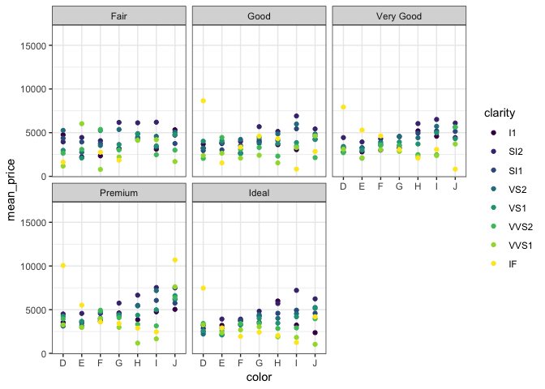
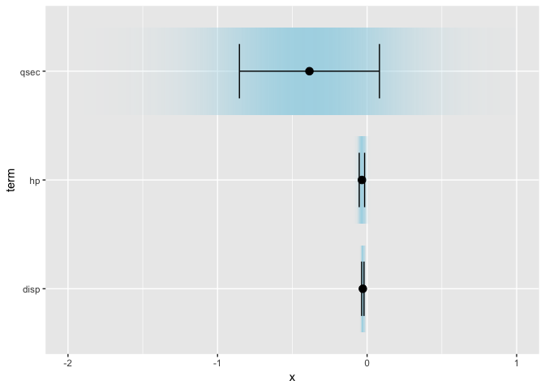

<!-- README.md is generated from README.Rmd. Please edit that file -->

# ungeviz

Tools for visualizing uncertainty with ggplot2, written by Claus O.
Wilke

This package is in the very early stages of development. Most things are
broken. However, the bootstrapping functions may already be useful for
generating hypothetical outcomes plots.

The package name comes from the German word “Ungewissheit”, which means
uncertainty.

## Installation

``` r
devtools::install_github("clauswilke/ungeviz")
```

## Bootstrapping

The functions `bootstrap_summarize()` and `bootstrap_do()` are drop-in
equivalents for dplyr’s `summarize()` and `do()` but perform the
respective action multiple times on bootstrapped data. Similarly, the
function `bootstrap()` generates a bootstrapped data frame and the
function `bootstrapper()` generates a bootstrapping object that can be
used instead of data in ggplot2 layers.

``` r
library(tidyverse)
library(ungeviz)
library(gganimate)

diamonds %>% group_by(cut, color, clarity) %>%
  bootstrap_summarize(20, mean_price = mean(price)) %>%
  ggplot(aes(color, mean_price, color = clarity)) +
    geom_point() + facet_wrap(~cut) +
    theme_bw() + transition_states(.draw, 1, 1)
```

<!-- -->

``` r
mtcars %>% bootstrap(20) %>%
  ggplot(aes(mpg, hp)) + 
    geom_smooth(
      data = mtcars,
      method = "gam", formula = y ~ s(x, k = 3),
      color = NA
    ) + 
    geom_point(data = mtcars) +
    geom_smooth(
      method = "gam",
      formula = y ~ s(x, k = 3),
      se = FALSE
    ) + 
    theme_bw() +
    # `.draw` is a generated column indicating the bootstrap
    # draw a data row belongs to 
    transition_states(.draw, 1, 1)
```

<!-- -->

``` r
data(BlueJays, package = "Stat2Data")

# set up bootstrapping object that generates 20 bootstraps
# and groups by variable `KnownSex`
bs <- ungeviz::bootstrapper(20, KnownSex)

ggplot(BlueJays, aes(BillLength, Head, color = KnownSex)) +
  geom_point(alpha = 0.3) +
  # `.row` is a generated column providing a unique row number
  # to all rows in the bootstrapped data frame 
  geom_point(data = bs, aes(group = .row)) +
  geom_smooth(data = bs, method = "lm", fullrange = TRUE, se = FALSE) +
  facet_wrap(~KnownSex, scales = "free_x") +
  scale_color_manual(values = c(F = "#D55E00", M = "#0072B2"), guide = "none") +
  theme_bw() +
  transition_states(.draw, 1, 1) + 
  enter_fade() + 
  exit_fade()
```

<!-- -->

## Visualizing uncertainty from fitted models

Some very early code exists to help visualizing uncertainty from fitted
models, for example as confidence strips.

``` r
library(broom)
#> 
#> Attaching package: 'broom'
#> The following object is masked from 'package:ungeviz':
#> 
#>     bootstrap

df_model <- lm(mpg ~ disp + hp + qsec, data = mtcars) %>%
  tidy() %>%
  filter(term != "(Intercept)")

ggplot(df_model, aes(estimate = estimate, moe = std.error, y = term)) +
  stat_conf_strip(fill = "lightblue", height = 0.8) +
  geom_point(aes(x = estimate), size = 3) +
  geom_errorbarh(aes(xmin = estimate - std.error, xmax = estimate + std.error), height = 0.5) +
  scale_alpha_identity() +
  xlim(-2, 1)
```

<!-- -->
